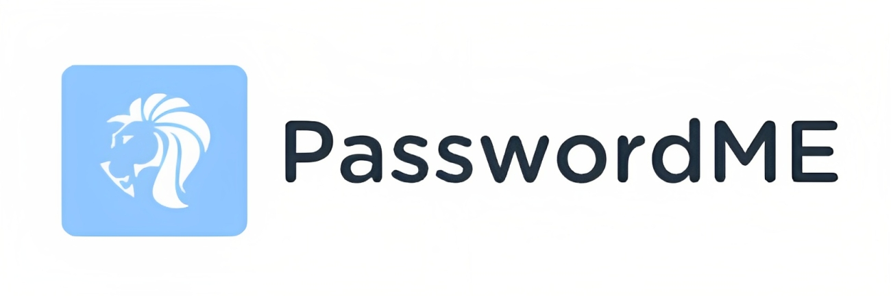
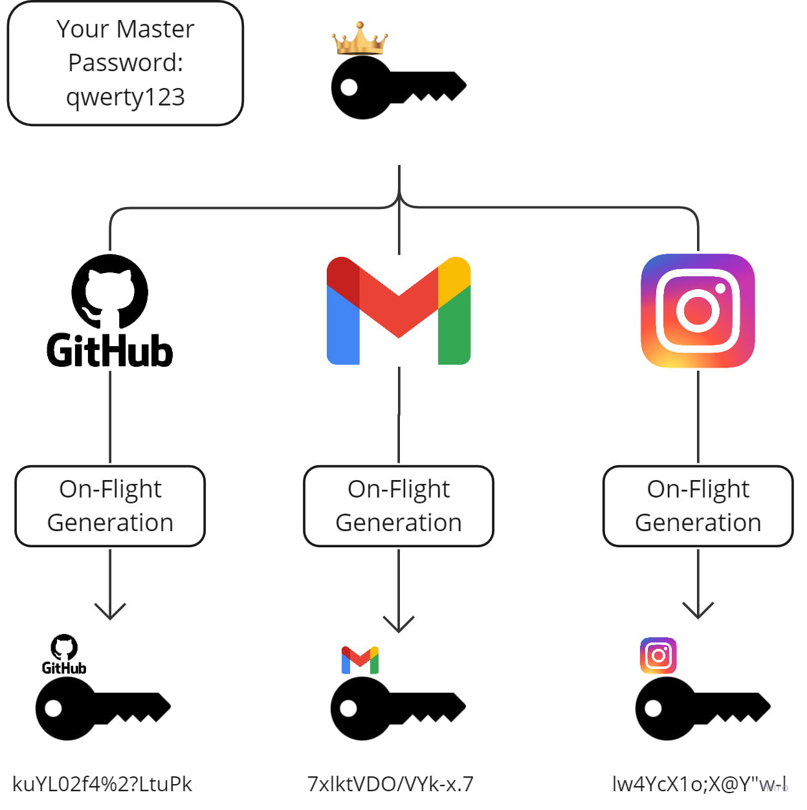

# PasswordME

PasswordME is a tiny cross-platform password manager, which can generate passwords for different services using your favorite password

**The key features:**
- hack-resistant
- determented
- on-flight generation
- save password in encrypt file (soon)

## Overview

## Problem
I'm sure most of us have one good password that we came up with once and now use everywhere, in all services. 
Clearly this is a bad thing.

With the streamlining of technology, hackers are finding more and more vulnerabilities in the security systems of the biggest companies, let alone the smaller ones. That's why we often hear about a database leak.

And now imagine if your only "good" password was leaked in some database. I think you know what a malicious person can do with it.

**PasswordME will help to solve this problem.**
